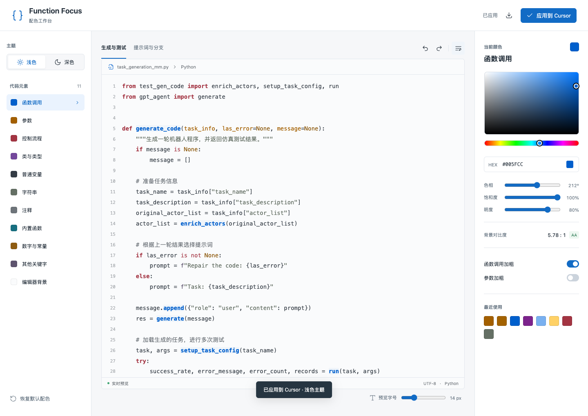
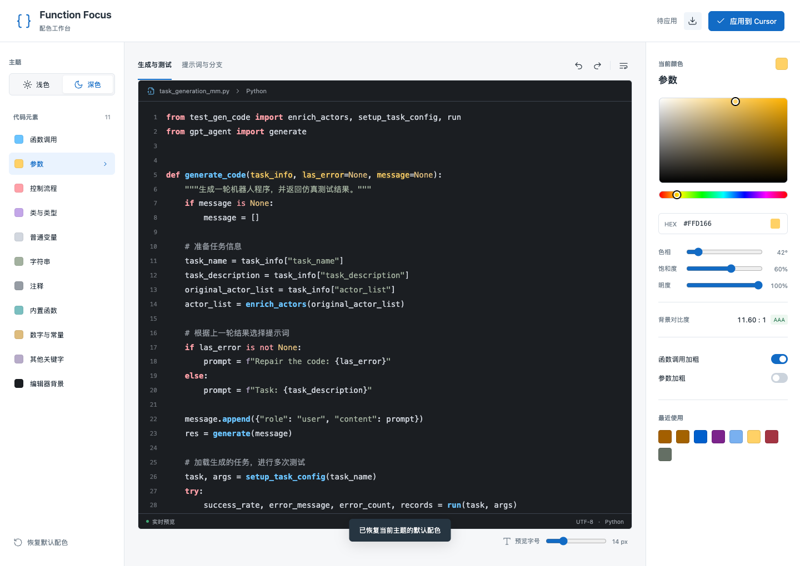

# Function Focus 配色工作台

为阅读长函数设计的 Cursor 主题和本地配色工具。突出函数定义、函数调用、参数和控制流程，降低长字符串与注释的视觉干扰。



## 功能

- 拖动色板和色相、饱和度、明度滑块，实时预览 Python 代码。
- 分别调整函数调用、参数、控制流程、字符串、注释等 11 类配色。
- 函数调用和参数加粗开关，浅色与深色主题。
- HEX 输入、最近使用的颜色、撤销与重做、恢复默认。
- 预览字号、换行、背景对比度显示和主题 JSON 导出。
- 一键应用到 Cursor；写入前自动备份设置。

## 安装与启动

当前配色工作台面向 **macOS**，需要：

- Node.js 20 或更新版本，以及 npm。
- Cursor 安装在 `/Applications/Cursor.app`，已启动过并创建用户设置文件。
- 工作台读取 Cursor 自带的 TextMate、Oniguruma、JSONC 解析器与 Python 语法文件；如果 Cursor 后续版本改变这些内部路径，需要相应调整。

```sh
git clone https://github.com/caixinying-less-is-more/function-focus-studio.git
cd function-focus-studio
npm ci
```

先在 Cursor 命令面板中执行 `Extensions: Install from VSIX...`，选择仓库里的 `function-focus-1.1.0.vsix`。如果已配置 Cursor 命令行，也可以运行：

```sh
cursor --install-extension ./function-focus-1.1.0.vsix
```

启动工作台：

```sh
npm start
```

打开终端打印的地址，通常是 <http://127.0.0.1:4317>。端口被占用时会自动尝试后续端口，以上述实际输出为准。终端进程需要保持运行，按 Ctrl+C 停止服务。

左侧选择代码元素，右侧拖动调色，中间实时预览；点击 **应用到 Cursor** 后保存到编辑器。

主题扩展本身是纯 JSON，可用于 Cursor / VS Code；工作台目前仅适配 macOS Cursor 默认安装位置与默认用户设置。

## 设置与数据

工作台只监听 `127.0.0.1`，运行时无需外部服务或 LLM。

点击应用会更新 `~/Library/Application Support/Cursor/User/settings.json` 中的当前主题、语义高亮开关及 Function Focus 专属配色；保留无关设置和其他主题的定制。

- `backups/`：每次应用前的完整设置备份。
- `studio-state.json`：已应用的配色。
- 浏览器 localStorage：尚未应用的配色草稿。
- `studio-server.json`：本次服务地址与进程信息。

这些本机数据均被 `.gitignore` 排除。恢复某次完整设置前请先检查备份内容，因为整份恢复也会覆盖此后修改的其他设置。

预览使用 Python TextMate 语法；Cursor 还可能叠加语言服务提供的语义高亮，因此个别标识符的分类会有所区别。主题按语法角色着色，不能判断某个函数在业务上是否更重要。

## 开发与验证

```sh
npm run build
npm test
```

`build.cjs` 定义默认调色板和主题规则，生成 `extension/themes/` 下的主题 JSON。测试覆盖默认配色对比度、Python 高亮、设置写入和输入校验。

浏览器交互测试需要已运行的工作台，以及安装在默认位置的 Google Chrome：

```sh
node studio/browser.test.cjs
```

注意：该交互测试会点击“应用到 Cursor”，将默认浅色主题写入当前用户的 Cursor 设置；运行前请确认接受此操作，设置会自动备份。

重新生成主题后，可在仓库根目录重新打包扩展（macOS 自带 `zip`）：

```sh
zip -r function-focus-1.1.0.vsix '[Content_Types].xml' extension.vsixmanifest extension
```

## 深色预览



## 许可证

MIT，见 [LICENSE](LICENSE)。
